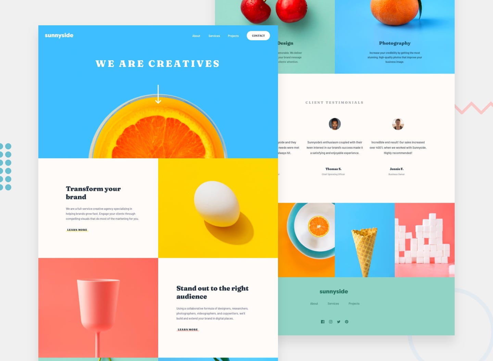

# Frontend Mentor - Sunnyside agency landing page solution

This is a solution to the [Sunnyside agency landing page challenge on Frontend Mentor](https://www.frontendmentor.io/challenges/sunnyside-agency-landing-page-7yVs3B6ef). Frontend Mentor challenges help you improve your coding skills by building realistic projects.

## Table of contents

- [Overview](#overview)
  - [The challenge](#the-challenge)
  - [Screenshot](#screenshot)
  - [Links](#links)
- [My process](#my-process)
  - [Built with](#built-with)
  - [What I learned](#what-i-learned)
  - [Continued development](#continued-development)
  - [Useful resources](#useful-resources)
- [Author](#author)
- [Acknowledgments](#acknowledgments)

## Overview

### The challenge

Users should be able to:

- View the optimal layout for the site depending on their device's screen size
- See hover states for all interactive elements on the page

### Screenshot




### Links

- Solution URL: [Github Repository](https://github.com/comendrun/sunnyside-agency-landing-page)
- Live Site URL: [live site](https://comendrun.github.io/sunnyside-agency-landing-page/)

## My process

### Built with

- Semantic HTML5 markup
- CSS custom properties
- Flexbox
- CSS Grid
- Mobile-first workflow

### What I learned

For this Challenge, we could have several options to achieve what we want. first of all i wanted to try this one with css backgound-image way. in this method, i defined every div that we could have in our page and by assigning a background image with css on them, i controlled changing pictures from mobile state to desktop state. i think i could also assign a picture directly to divs and then hide mobile or desktop images in opposite cases with css or even js. but i preffered this method and despite the complexity it added to the project, i liked the experience.
but if i had to start over this project, i wouldn do it with this approach, because withoud any content the div's where hard to assign a non-specific height or width and it added a little to the time i finished the project.
over all i liked the experience and i hope i can do much better works in the future.

<!-- To see how you can add code snippets, see below:

```html
<h1>Some HTML code I'm proud of</h1>
```

```css
.proud-of-this-css {
  color: papayawhip;
}
```

```js
const proudOfThisFunc = () => {
  console.log("🎉");
};
```

If you want more help with writing markdown, we'd recommend checking out [The Markdown Guide](https://www.markdownguide.org/) to learn more.

**Note: Delete this note and the content within this section and replace with your own learnings.** -->

### Continued development

I do feel that it could be done much faster and easier with ReactJS. but i decided to go with vanilla JS and i didnt regret the experience. maybe next time...

### Useful resources

## Author

- Website - [@comendrun](https://github.com/comendrun)
- Frontend Mentor - [@comendrun](https://www.frontendmentor.io/profile/comendrun)
- Twitter - [@comendrun](https://twitter.com/comendrun)

## Acknowledgments
